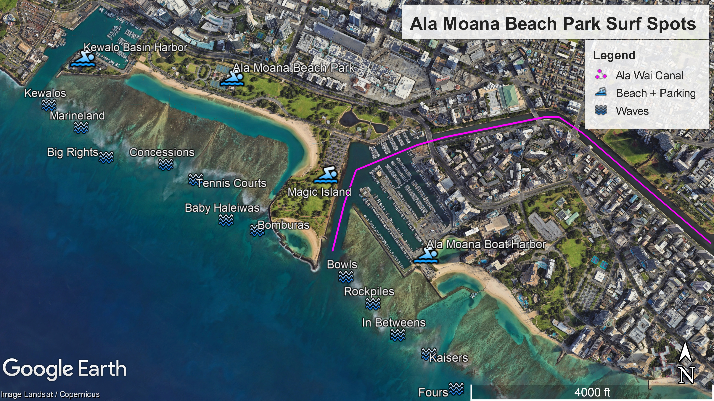
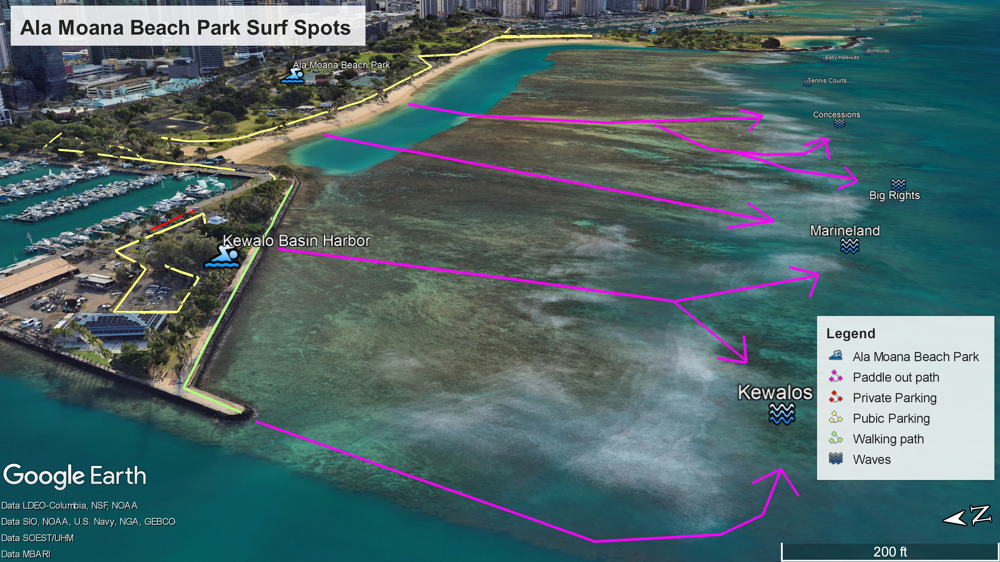

# GIS Ala Moana Surf Spots Portfolio

This project showcases a collection of Google Earth Pro 2D and 3D screenshots highlighting the surf spots at my local surf break in Ala Moana in Honolulu, Hawai'i. The aim of this project is to blend GIS technology with knowledge of these surf spots, demonstrating the spatial context of my favorite surf locations.

## Project Overview

- **Purpose:**  
  To document and share detailed GIS visualizations of local surf spots using high-quality Google Earth Pro screenshots.
  
- **Data Source:**  
  Google Earth Pro imagery along with personal insights on surf conditions and location features.

- **Location:**  
  Ala Moana, known for its vibrant surf culture and ideal local breaks.

## Surf Spot Overview

Below are some examples of the surf spots featured in this portfolio:

### Ala Moana Surf Spot Overview

*Description: These surf breaks offer a wide assortment of waves depending on the day, ranging from light longboarding to hollow barrels.*

### Get to Surf Breaks from the Ala Moana Boat Harbor

*Description: The Ala Moana Boat Harbor offers access to Bowls, Kaisers, Rockpiles and In Betweens. Fours is not surfed often..*

### Get to Surf Breaks from the Kewalo Harbor Basin

*Description: The Kewalo Harbor Basin offers access to Kewalos and Marineland*

## How This Project Was Made

1. **Data Collection:**  
   Google Earth Pro was used to capture detailed 3D and 2D screenshots of the surf spots.
   
2. **GIS Analysis:**  
   The images were analyzed to identify key geographical features such as wave break patterns, parking, and wave accessibility.

## Future Enhancements

- Adding interactive maps using web-based GIS tools.
- Incorporating dynamic data layers (e.g., tide levels, weather conditions).
- Expanding the portfolio to include additional surf locations and comparative analysis.

## How to Contribute

If you’d like to contribute ideas or improvements, feel free to open an issue or submit a pull request. All contributions are welcome!

## License

This project is licensed under the MIT License. See the [LICENSE](LICENSE) file for details.

---

*Created with passion for surfing and GIS, highlighting the beauty of our local break in Ala Moana.*
