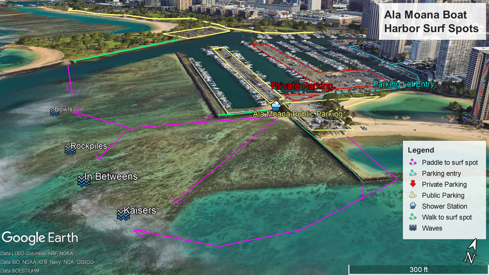

# GIS Ala Moana Surf Spots Portfolio

This project showcases a collection of Google Earth Pro screenshots highlighting the surf spots at my local break in Ala Moana in Honolulu, Hawai'i. The aim of this project is to blend GIS technology with knowledge of these surf spots, demonstrating the spatial context of my favorite surf locations.

## Project Overview

- **Purpose:**  
  To document and share detailed GIS visualizations of local surf spots using high-quality Google Earth Pro screenshots.
  
- **Data Source:**  
  Google Earth Pro imagery along with personal insights on surf conditions and location features.

- **Location:**  
  Ala Moana, known for its vibrant surf culture and ideal local breaks.

## Gallery

Below are some examples of the surf spots featured in this portfolio:

### Ala Moana Surf Spot Overview

*Description: These 5 prime breaks offer a wide assortment of waves depeneding on the day, ranging from light longboarding to hollow barrels.*

### Surf Spot 2

*Description: A scenic view of the coastline with optimal conditions for intermediate surfers.*

## How This Project Was Made

1. **Data Collection:**  
   Google Earth Pro was used to capture detailed screenshots of the surf spots. Each image was taken during different times of the day to highlight varying conditions.
   
2. **GIS Analysis:**  
   The images were analyzed to identify key geographical features such as wave break patterns, shoreline contours, and accessibility.
   
3. **Image Processing:**  
   Screenshots were refined using graphic editing tools to annotate and enhance the imagery for better clarity.
   
4. **Documentation:**  
   This repository houses the final images along with documentation on the methods and findings from the GIS analysis.

## Future Enhancements

- Adding interactive maps using web-based GIS tools.
- Incorporating dynamic data layers (e.g., tide levels, weather conditions).
- Expanding the portfolio to include additional surf locations and comparative analysis.

## How to Contribute

If you’d like to contribute ideas or improvements, feel free to open an issue or submit a pull request. All contributions are welcome!

## License

This project is licensed under the MIT License. See the [LICENSE](LICENSE) file for details.

---

*Created with passion for surfing and GIS, highlighting the beauty of our local break in Ala Moana.*
